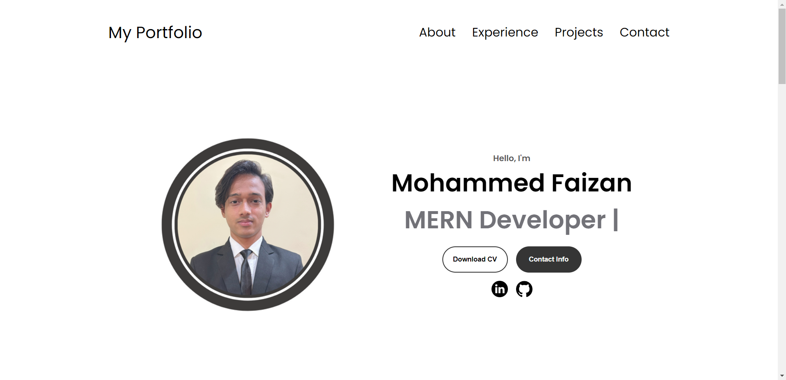
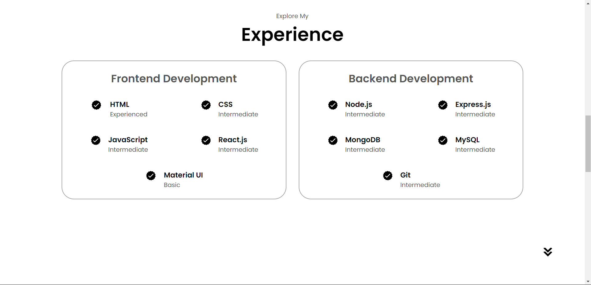
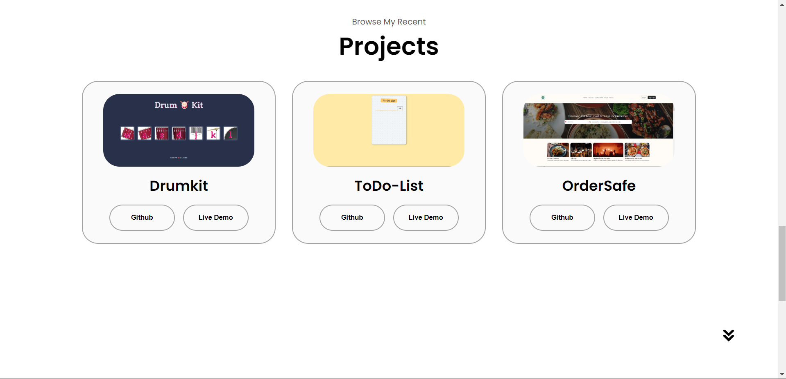
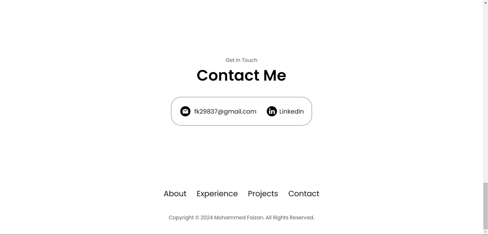

# Documentation: Mohammed Faizan's Portfolio

Overview
This HTML document is for a personal portfolio website of Mohammed Faizan, a Full Stack developer. It includes various sections such as navigation, profile, about, experience, projects, and contact information. It also links to external CSS and JavaScript files for styling and functionality.

## Technologies Used

- HTML
- CSS
- JavaScript

## Usage

To run the project locally:

1. Clone this repository.
2. Open `index.html` in a web browser.

## Screenshots

## Demo

A live demo of the project can be found at [ Demo URL]().

## Contributing

Contributions are welcome! Please fork the repository and submit a pull request with your improvements.

## License

This project is licensed under the MIT License - see the LICENSE file for details.
